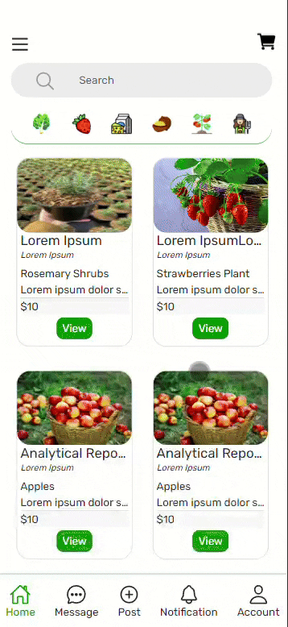
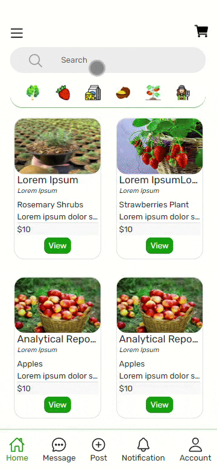

# Project Title
# Comp 1800 - Burnaby 14

## 1. Project Description
Our team BBY14 including Isaac, Joey, and Linh is developing Farmify, a commercial app that connects farmers directly with  consumers to reduce the cost and time spent buying fresh and healthy produce while supporting local, small-scale farms that contributes to our community's sustainability and increase the farmers' profit share. 
Users can now create a post, write their reviews, bookmark their favorites, add items to their carts, and send a message to the farms.
Users can also enjoy better experience using the app thanks to improved UI design, add items to cart with the price calculated and go to checkout page, review and leave star rating for each post, view their current location with Google map on our app, unsave bookmarks.

## 2. Names of Contributors
List team members and/or short bio's here... 
* Hi, my name is Linh. I am just happy to be here.
* Hello again, it's Linh. I am here for fun!
* Joey Jahanshahi, Hello!
* Isaac Azage (left)
	
## 3. Technologies and Resources Used
List technologies (with version numbers), API's, icons, fonts, images, media or data sources, and other resources that were used.
* HTML, CSS, JavaScript
* Bootstrap 5.0 (Frontend library)
* Firebase 8.0 (BAAS - Backend as a Service)
* Firestore (BAAS - Backend as a Service)
* Firebase Cloud Storage (BAAS - Backend as a Service)

Acknowledgement of free usage for icons:
* Vegetables icons created by Freepik - Flaticon
* Fruit icons created by Freepik - Flaticon
* Dairy products icons created by Smashicons - Flaticon
* Macadamia icons created by surang - Flaticon
* Farmer icons created by Freepik - Flaticon
* Tomato icons created by Pixelmeetup - Flaticon
* Book mark icons created by Aldo Cervantes - Flaticon

## 4. Complete setup/installion/usage
Due to our project being at an early stage and limited time and personel, we have not been able to design to accomodate bigger screen size on computers, laptops or various other devices. Our design focus has always been designing for mobile first. And we chose Iphone 14 Promax screen size for this project UI design. Therefore, to enjoy the best UI/UX, please adjust your screen size to Iphone 14 Promax when using our web app. 
Here are some simple instructions.
* Go to our landing page from this link: https://comp1800-bby14-b87af.web.app/
* Right click anywhere on the web page
* Select Inspect at the bottom of the menu (or press F12 on your keyboard) to view developer mode.
* Select the 2nd icon, which looks like a computer with a phone, from the left next to the icon with an arrow pointing right-up.
* On the top control bar above the app, click on Dimensions: and select iPhone14 Promax.
* Now you can view or app with the latest UI updates.
* You can create a fake account in the format of an email to log in, for example user@bcit.ca, fill out your name and password.
* Optionally, if you need bigger screen size because the default screen size is too small for you, please unselect the computer with phone icon, and adjust the screen size as you wish. Our recommendation is 460 x 695 pixel to maintain relatively proper UI elements.
* After logging in, you can try different features that we have been able to implement so far.
* Finally, we would love to hear about your experience or feedback, please help us complete a small survey on this link. https://docs.google.com/forms/d/1fGqkebst4PxXcXgrAWfM3m8XMgkNt9S7ZDzuCHzWxME/edit
* Thank you, I hope you will enjoy using our app.

## 5. Demos


Here is a table with titles/descriptions in the first row and GIFs in the second row:

| Create a Post          | Write Reviews          | Add to Cart/Buy         | Search & Filter          |
|------------------|------------------|------------------|------------------|
|    |    |    |    |


## 6. Known Bugs and Limitations
Here are some known bugs:
* Average star rating display on each post page increases from 5 to 6 when calculating average rating
* Current location is not yet accurate
* ...

## 7. Features for Future
What we'd like to build in the future:
* Collecting data from various site to make price suggestions
* Full text search
* Recommendations based on personal history
	
## 8. Contents of Folder

```
├── .firebase
│  └── hosting..cache
├── .firebaserc
├── .gitignore
├── .vscode
│  └── settings.json
├── 1800_202410_BBY14.code-workspace
├── 404.html
├── AboutUs.html
├── cart.html
├── chat.html
├── contactus.html
├── createPost.html
├── dairy.html
├── eachpost.html
├── empty.html
├── firebase.json
├── firestore.indexes.json
├── firestore.rules
├── fruits.html
├── images
│  ├── 1800-interaction.gif
│  ├── 1800-login.gif
│  ├── 1800-posting.gif
│  ├── 1800-review.gif
│  ├── 1800-search_filter.gif
│  ├── AM01.jpg
│  ├── apple-har.jpg
│  ├── apple.jpg
│  ├── avatar.jpg
│  ├── avatar1.jpg
│  ├── basket.jpg
│  ├── bookmark-dark.png
│  ├── bookmark.png
│  ├── brocoli.jpg
│  ├── card1.png
│  ├── card2.png
│  ├── card3.png
│  ├── card4.png
│  ├── card5.png
│  ├── card6.png
│  ├── card7.png
│  ├── card8.png
│  ├── carrot.jpg
│  ├── cheese.png
│  ├── cherry-tomatoes.jpg
│  ├── Colby-Cheese-4.jpg
│  ├── collard.png
│  ├── cottage-ch.jpg
│  ├── cucumber.jpg
│  ├── eggplant.jpg
│  ├── farm-delivery.jpg
│  ├── farm-delivery1.jpg
│  ├── farm-delivery2.jpg
│  ├── farmer.png
│  ├── image.jpeg
│  ├── kales.jpg
│  ├── logo.png
│  ├── macadamia.png
│  ├── milk.png
│  ├── mint-plant.jpg
│  ├── orange-basket.jpg
│  ├── orange.png
│  ├── oranges.jpg
│  ├── rosemary.png
│  ├── spinach.jpg
│  ├── strawberry-1330459_640.jpg
│  ├── strawberry-plant.jpg
│  ├── strawberry.png
│  ├── tomato-basket.jpg
│  ├── tomato.png
│  ├── veg-basket.jpg
│  ├── veggie.jpg
│  └── veggie1.jpg
├── index.html
├── login.html
├── main.html
├── messages.html
├── nuts.html
├── plants.html
├── profile.html
├── README.md
├── review.html
├── scripts
│  ├── authentication.js
│  ├── cart_selection.js
│  ├── cart.js
│  ├── client.js.plush
│  ├── create_post.js
│  ├── createPost.js
│  ├── dairy.js
│  ├── eachpost.js
│  ├── filter_categories.js
│  ├── firebaseAPI_TEAM99.js
│  ├── fruits.js
│  ├── generate_search_results.js
│  ├── goback.js
│  ├── home.js
│  ├── indexgenerator.js
│  ├── main.js
│  ├── messages.js
│  ├── nuts.js
│  ├── plants.js
│  ├── profile.js
│  ├── review.js
│  ├── save_post.js
│  ├── script.js
│  ├── search_firestore.js
│  ├── search_result.js
│  ├── searchbar-scroll.js
│  ├── skeleton.js
│  ├── success_purchase.js
│  └── vegetables.js
├── search_results.html
├── storage.rules
├── styles
│  ├── style_cart.css
│  ├── style_eachPost.css
│  ├── style_messages.css
│  ├── style_review.css
│  ├── style_successPurchase.css
│  ├── style-createPost.css
│  ├── style-profile.css
│  └── style.css
├── success_purchase.html
├── text
│  ├── footer.html
│  ├── nav_after_login.html
│  └── nav_before_login.html
├── thanks.html
└── vegetables.html

```


